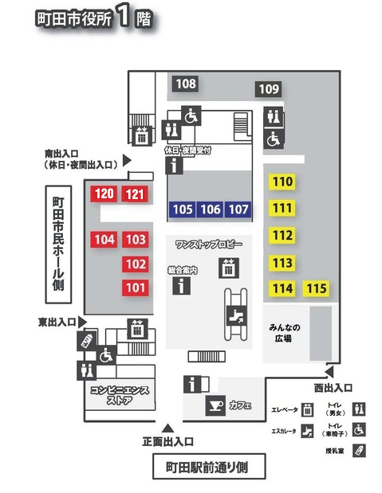
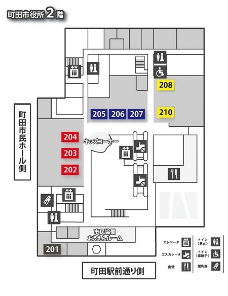
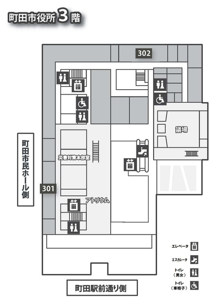

  📍 会場マップナビゲーション
  <a href="events.html" style="display: inline-flex; align-items: center; gap: 8px; padding: 12px 24px; background: #27ae60; color: #ffffff; text-decoration: none; border-radius: 6px; font-weight: bold; font-size: 21px; transition: background 0.2s;">
    📅 イベントプログラム・出展一覧はこちら ➔
  </a>

## 🗺️ 会場案内・フロアマップナビゲーション

見たいエリア・階数を選択すると、アクセスマップとフロアマップ画像が自動で連動して切り替わります。

  <h4 style="margin: 0 0 16px 0; color: #2c3e50; font-size: 23px; display: flex; align-items: center; gap: 8px;">
    🔍 フロア・エリアから直接探す
  </h4>
  

    

      <label style="font-size: 19px; color: #444; display: block; margin-bottom: 8px; font-weight: bold;">① フロアを選択</label>
      <select id="floor-select" onchange="onFloorSelectChange(this.value)" style="width: 100%; padding: 12px 16px; border-radius: 6px; border: 1px solid #ced4da; background: #fff; font-size: 21px;">
        <option value="all">全エリア表示（ピン非表示）</option>
        <option value="1f_out">1F 屋外マルシェ・広場</option>
        <option value="1f_in">1F 屋内（ワンストップ・みんなの広場）</option>
        <option value="2f">2F 会議室・おうえん・キッズスペース</option>
        <option value="3f">3F 会議室・アトリウム・議場</option>
        <option value="hall">市民ホール</option>
      </select>
    

    
    

      <label style="font-size: 19px; color: #444; display: block; margin-bottom: 8px; font-weight: bold;">② エリア・ブースを選択</label>
      <select id="area-select" onchange="onAreaSelectChange(this.value)" style="width: 100%; padding: 12px 16px; border-radius: 6px; border: 1px solid #ced4da; background: #fff; font-size: 21px;" disabled>
        <option value="">フロアを先に選択してください</option>
      </select>
    

  

  <button class="floor-btn active" data-floor="all" onclick="switchFloorMap('all', 'all_img')">全エリア</button>
  <button class="floor-btn" data-floor="1f_out" onclick="switchFloorMap('1f_out', 'all_img')">1F 屋外</button>
  <button class="floor-btn" data-floor="1f_in" onclick="switchFloorMap('1f_in', 'floor1_img')">1F 屋内</button>
  <button class="floor-btn" data-floor="2f" onclick="switchFloorMap('2f', 'floor2_img')">2F</button>
  <button class="floor-btn" data-floor="3f" onclick="switchFloorMap('3f', 'floor3_img')">3F</button>
  <button class="floor-btn" data-floor="hall" onclick="switchFloorMap('hall', 'all_img')">市民ホール</button>

  
  

    <h3 style="margin-top: 0; font-size: 25px;">📍 アクセスマップ</h3>
    

  

  

    <h3 style="margin-top: 0; text-align: left; font-size: 25px;">🏢 庁舎内・会場レイアウト</h3>
    
    

      

        上の選択メニューまたはボタンから<b>「1F屋内」「2F」「3F」</b>を選択すると、 
        ここに詳細なフロアマップ（画像）が表示されます。  
        選択されたエリアのみ地図上にピンが表示されます！
      

    

    

      
      

    

    
    

      
      

    

    
    

      
      

    

  

  <strong id="info-title" style="color: #d35400; font-size: 23px; display: block;"></strong>
  

<link rel="stylesheet" href="https://unpkg.com/leaflet@1.9.4/dist/leaflet.css" />

---
## 🗺️ アクセス

### メイン会場：町田市役所本庁舎
* 〒194-8520 東京都町田市森野2-2-22
* 小田急線町田駅「西口」から徒歩約8分
* JR横浜線町田駅「北口」から徒歩約11分
> ※イベント当日は混雑が予想されます。公共交通機関でのご来場にご協力をお願いいたします。
